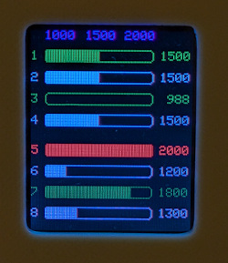
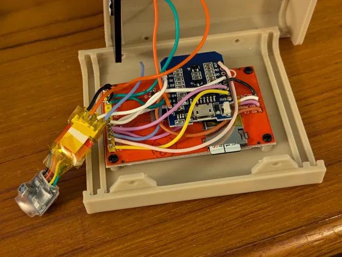
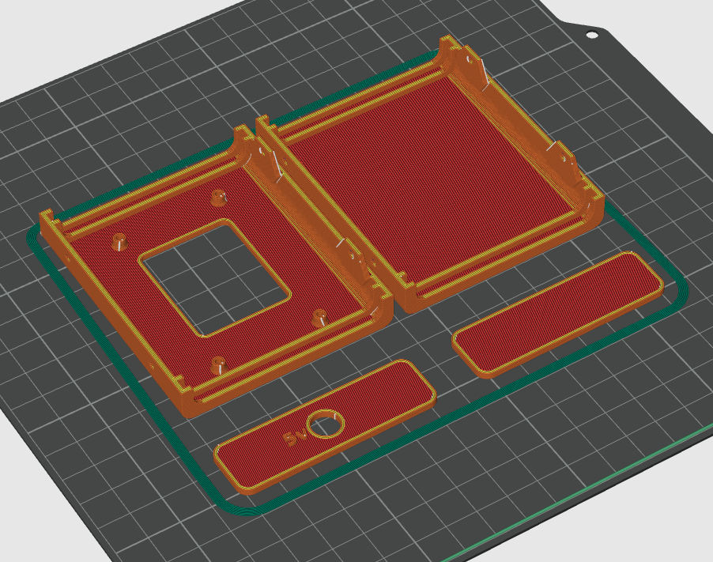

# Arduino color display of ELRS control (channel) data values

* Demo video: (https://github.com/sercona/rc-elrs-live-channel-display/blob/main/elrs-controller-demo1.mp4)

* Based on some demo code from the expresslrs project

* Hardware needed:
  - ESP8266 (eg, wemos d1 mini)
  - elrs serial receiver (as normally used in a quadcopter, etc)
  - SPI TFT display ST7735 (https://www.amazon.com/gp/product/B0C2HNVSWV/)
  - 3d printed case
  
* Software:
  - Import the code as you normally would with the arduino IDE
  - Flash your esp8266 over its usb serial port.  IMPORTANT: remove the elrs receiver when you serial-flash your ESP chip.
  - Once flash is done, the elrs rx can now be plugged into the serial rx gpio of the ESP8266.

* Connections:
  - Only 3 wires are needed for elrs listening; the data wire (to the RX gpio of the ESP), and 5v power and ground.
  - Power the ESP chip, tft display and elrs module from an external 5v supply.
  - If you need to reflash the ESP, remember to remove the elrs (or put a switch on the single data line) before you flash and reconnect after flash is done.
  
  

* 3D print STL files in the stl folder
  

